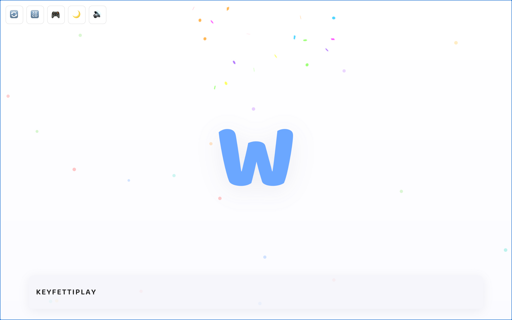

# Keyfetti 🎉

**Press a key. Watch it pop. Make confetti.**



Keyfetti is a free typing game for young kids. Every keypress bursts a big colorful letter onto the screen with a pop sound and a shower of confetti, then floats it down into a little document at the bottom of the page. No score pressure, no way to lose, nothing to break.

**Play it here: [keyfetti.rudydogum.com](https://keyfetti.rudydogum.com/)**

No ads, no sign-up, no tracking.

---

## Why I built this

My small human sees me tapping away on the laptop and wants in — and I'd much rather encourage that curiosity than shoo it away. So I built them a safe little container to smash on the keys to their heart's content, hoping they pick up a few letters along the way. Every keypress is rewarded with color, sound, and confetti, and there's genuinely no wrong move.

Keyfetti was also my playground for **learning how to build with AI** — pairing with AI tools to design, code, and ship a real project end to end. It turned out to be the perfect first project: small enough to finish, fun enough to stay motivated, and my toughest QA tester lives down the hall.

---

## How to play

Open the game, click once so the page has keyboard focus, and start typing. It's designed for a desktop or laptop with a real keyboard.

- **Free Type** — the sandbox. Press any letter A–Z and it pops, fires confetti, and drifts into the document below.
- **Words** — a 60-second round. Type the word on screen; each one you finish adds to your count. When time's up you can share your score or send a challenge link that dares a friend to beat it.

### Controls

| Button | What it does |
| :----: | ------------ |
| 🔄 | Restart and clear the screen |
| 🔠 | Toggle letters-only vs. all keys |
| 🎮 | Switch between Free Type and Words |
| 🌙 | Dark mode |
| 🔊 | Sound on/off |

---

## Design notes

- **No fail states.** Every key does something delightful; there's no game-over and no penalties.
- **Private by design.** No accounts, no analytics, no data collection. Even the font is bundled into the app instead of loaded from Google Fonts, so no third-party requests are made.
- **Free.** No ads, no upsells.

---

## Tech stack

A deliberately small, dependency-light build:

- **[Vite](https://vitejs.dev/)** + vanilla JavaScript (no framework)
- **[canvas-confetti](https://github.com/catdad/canvas-confetti)** for the star of the show
- Web Audio API for the pops and celebrations — synthesized on the fly, no sound files
- Self-hosted **Baloo 2** font via `@fontsource`
- Deployed on **Cloudflare**

---

## Running locally

```bash
# install dependencies
npm install

# start the dev server
npm run dev

# build for production
npm run build

# preview the production build
npm run preview
```

Then open the local URL Vite prints, click into the page, and start typing.

---

## Contributing

This is a personal learning project, but ideas, bug reports, and pull requests are welcome — open an issue and say hi.

---

## License

Keyfetti is released under the [MIT License](LICENSE) — free to use, fork, remix, and learn from.
